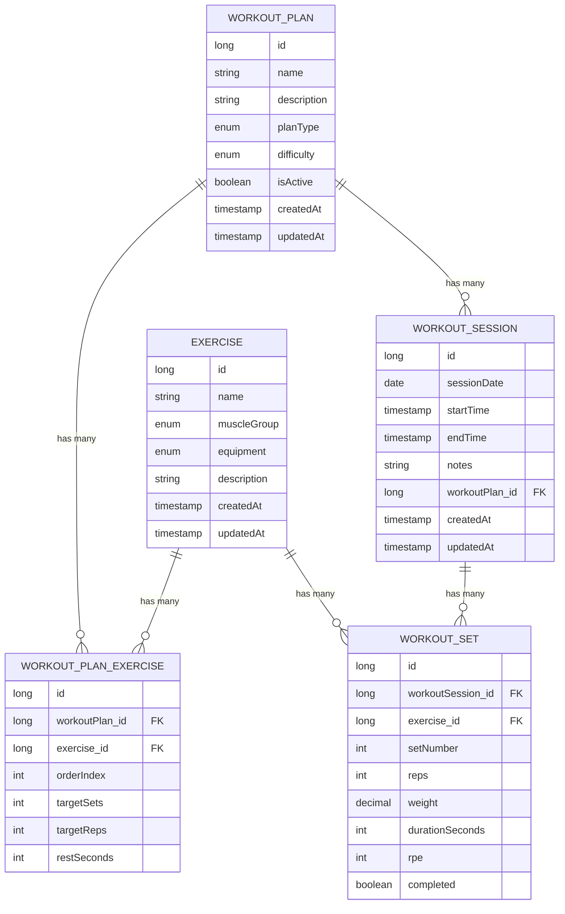

# Workout App Database Schema

## Entity Relationship Diagram

## Relationships

- **Exercise**: Master list of all exercises
- **WorkoutPlan**: Reusable workout templates (Leg Day, Push Day, etc.)
- **WorkoutPlanExercise**: Connects exercises to plans with metadata (order, target reps, rest)
- **WorkoutSession**: Records one actual workout performed on a date
- **WorkoutSet**: Records each individual set completed in a session
