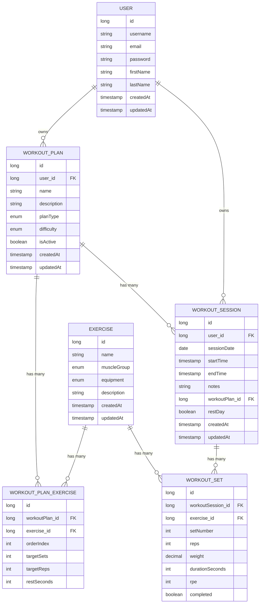

# Workout App Database Schema

## Entity Relationship Diagram

```mermaid
erDiagram
    USER ||--o{ WORKOUT_PLAN : "owns"
    USER ||--o{ WORKOUT_SESSION : "owns"
    EXERCISE ||--o{ WORKOUT_PLAN_EXERCISE : "has many"
    WORKOUT_PLAN ||--o{ WORKOUT_PLAN_EXERCISE : "has many"
    WORKOUT_PLAN ||--o{ WORKOUT_SESSION : "has many"
    WORKOUT_SESSION ||--o{ WORKOUT_SET : "has many"
    EXERCISE ||--o{ WORKOUT_SET : "has many"

    USER {
        long id
        string username
        string email
        string password
        string firstName
        string lastName
        timestamp createdAt
        timestamp updatedAt
    }

    EXERCISE {
        long id
        string name
        enum muscleGroup
        enum equipment
        string description
        timestamp createdAt
        timestamp updatedAt
    }

    WORKOUT_PLAN {
        long id
        long user_id FK
        string name
        string description
        enum planType
        enum difficulty
        boolean isActive
        timestamp createdAt
        timestamp updatedAt
    }

    WORKOUT_PLAN_EXERCISE {
        long id
        long workoutPlan_id FK
        long exercise_id FK
        int orderIndex
        int targetSets
        int targetReps
        int restSeconds
    }

    WORKOUT_SESSION {
        long id
        long user_id FK
        date sessionDate
        timestamp startTime
        timestamp endTime
        string notes
        long workoutPlan_id FK
        boolean restDay
        timestamp createdAt
        timestamp updatedAt
    }

    WORKOUT_SET {
        long id
        long workoutSession_id FK
        long exercise_id FK
        int setNumber
        int reps
        decimal weight
        int durationSeconds
        int rpe
        boolean completed
    }
```

## Enum Values

### MuscleGroup

`CHEST` `BACK` `SHOULDERS` `BICEPS` `TRICEPS` `FOREARMS` `LEGS` `QUADRICEPS` `HAMSTRINGS` `GLUTES` `CALVES` `ABS` `CARDIO` `BODYWEIGHT`

### Equipment

Cardio: `TREADMILL` `EXERCISE_BIKE_UPRIGHT` `RECUMBENT_BIKE` `SPIN_BIKE` `ELLIPTICAL` `CROSS_TRAINER` `ROWING_MACHINE` `STAIR_CLIMBER` `STEPMILL` `AIR_BIKE` `SKI_ERG` `JACOBS_LADDER` `VERSACLIMBER` `ARM_ERGOMETER` `CURVED_TREADMILL`

Upper Body Machines: `CHEST_PRESS_MACHINE` `INCLINE_CHEST_PRESS` `PEC_DECK` `CHEST_FLY` `SHOULDER_PRESS_MACHINE` `LATERAL_RAISE_MACHINE` `REAR_DELT_MACHINE` `LAT_PULLDOWN` `ASSISTED_PULL_UP_MACHINE` `SEATED_ROW_MACHINE` `CABLE_ROW` `PULL_UP_MACHINE` `PECKS_DECK_MACHINE`

Arms Machines: `BICEP_CURL_MACHINE` `TRICEP_EXTENSION_MACHINE` `PREACHER_CURL_MACHINE` `TRICEP_DIP_MACHINE`

Lower Body Machines: `LEG_PRESS` `HACK_SQUAT_MACHINE` `LEG_EXTENSION` `LEG_CURL_SEATED` `LEG_CURL_LYING` `GLUTE_KICKBACK_MACHINE` `HIP_ABDUCTION` `HIP_ADDUCTION` `CALF_RAISE_MACHINE`

Plate-Loaded: `SMITH_MACHINE` `POWER_RACK` `HACK_SQUAT_PLATE_LOADED` `PENDULUM_SQUAT` `BELT_SQUAT` `T_BAR_ROW_MACHINE` `PLATE_LOADED_CHEST_PRESS` `PLATE_LOADED_SHOULDER_PRESS`

Free Weights: `DUMBBELL` `BARBELL` `KETTLEBELL` `MEDICINE_BALL` `SAND_BAG` `WEIGHT_PLATES` `ADJUSTABLE_BENCH` `FLAT_BENCH` `INCLINE_BENCH` `DECLINE_BENCH` `SQUAT_RACK` `POWER_CAGE` `DEADLIFT_PLATFORM`

Cable: `CABLE_CROSSOVER` `FUNCTIONAL_TRAINER` `CABLE_PULLEY_MACHINE` `ADJUSTABLE_CABLE_MACHINE`

Functional: `BATTLE_ROPES` `MEDICINE_BALLS` `SLAM_BALLS` `SANDBAGS` `SLEDS_PUSH_PULL` `TRX_SUSPENSION_TRAINERS` `PLYOMETRIC_BOXES` `AGILITY_LADDERS` `CONES`

Bands: `RESISTANCE_BANDS` `LOOP_BANDS` `MINI_BANDS` `ANKLE_BANDS` `PULL_UP_ASSIST_BANDS` `POWER_BANDS` `THERAPY_BANDS` `TUBING_BANDS` `STRETCH_BANDS`

Yoga & Mobility: `YOGA_MATS` `YOGA_BLOCKS` `YOGA_STRAPS` `FOAM_ROLLERS` `MOBILITY_BALLS` `FOAM_ROLLER` `MASSAGE_BALLS` `STRETCH_STRAPS`

Core & Abs: `AB_CRUNCH_MACHINE` `CAPTAINS_CHAIR_LEG_RAISES` `ROMAN_CHAIR_HYPEREXTENSION_BENCH` `GHD_GLUTE_HAM_DEVELOPER` `AB_WHEEL` `SIT_UP_BENCH`

Recovery: `STRETCHING_STATION` `MASSAGE_GUN` `COMPRESSION_TOOLS` `ICE_HEAT_THERAPY_TOOLS`

Misc: `JUMP_ROPE` `AGILITY_HURDLES` `SPEED_LADDER` `WEIGHT_VEST` `SLED` `SAND_SLED` `FARMERS_WALK_HANDLES` `LOG_BAR` `YOKE` `BODYWEIGHT`

### WorkoutPlanType

`PUSH` `PULL` `LEGS` `UPPER_BODY` `LOWER_BODY` `FULL_BODY` `CARDIO` `STRETCHING` `CUSTOM` `BODYWEIGHT`

### PlanDifficulty

`BEGINNER` `MEDIUM` `INTERMEDIATE` `ADVANCED` `EXPERT`

## Relationships

- **User**: Application users who own workout plans and sessions
- **Exercise**: Master list of all exercises (global, not user-scoped)
- **WorkoutPlan**: Reusable workout templates (Leg Day, Push Day, etc.) owned by users
- **WorkoutPlanExercise**: Connects exercises to plans with metadata (order, target reps, rest)
- **WorkoutSession**: Records one actual workout or rest day performed on a date by a user
- **WorkoutSet**: Records each individual set completed in a session
